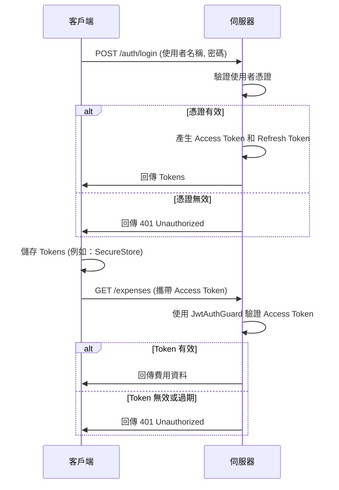

# API 實作細節深度教學

本文件提供了一份關於 API 實作細節、架構和設計模式的深度教學，旨在幫助開發者快速理解並參與開發。

## 1. 總覽

本 API 是費用追蹤應用程式的後端，旨在支援多使用者協作、資料同步以及對財務資料的安全存取。它建立在一個現代化、可擴展且易於維護的技術堆疊之上。

### 核心技術選擇

- **框架 (Framework)**: **[NestJS](https://nestjs.com/) (v11)**
  - **選擇原因**: NestJS 是一個漸進式的 Node.js 框架，它提供了一個開箱即用的應用程式架構，允許開發人員建立可測試、可擴展、鬆散耦合且易於維護的應用程式。它基於 TypeScript，並結合了物件導向程式設計、函數式程式設計和函數式響應式程式設計的元素。其模組化的架構和對依賴注入的支援，使得管理複雜的應用程式變得輕而易舉。

- **資料庫 (Database)**: **[PostgreSQL](https://www.postgresql.org/)**
  - **選擇原因**: PostgreSQL 是一個功能強大、開源的物件關聯式資料庫系統，以其可靠性、功能完整性和效能而聞名。它支援複雜的查詢、JSONB 資料類型（這對於儲存彈性資料結構非常有用），以及強大的交易控制，這些都是我們應用程式所必需的。

- **ORM (Object-Relational Mapping)**: **[TypeORM](https://typeorm.io/)**
  - **選擇原因**: TypeORM 是一個成熟的 ORM，可以與 TypeScript 和最新的 JavaScript 功能無縫整合。它允許我們使用 TypeScript 類別來定義資料庫模型（Entities），並透過裝飾器（Decorators）來對應資料庫表格的欄位。這使得資料庫操作更加直觀和型別安全。

- **認證 (Authentication)**: **[Passport.js](http.www.passportjs.org/)**
  - **選擇原因**: Passport.js 是 Node.js 中最受歡迎的認證中介軟體。它極其靈活和模組化，可以輕鬆地整合各種認證策略（例如 JWT、OAuth、LDAP 等）。我們主要使用其 JWT 策略來保護我們的 API 端點。

## 2. 專案結構

本 API 遵循模組化的架構，實現了關注點分離（Separation of Concerns）。

### 主要目錄結構

- `src`: 包含應用程式的所有原始碼。
  - `main.ts`: 應用程式的進入點，負責建立 NestJS 應用程式實例並啟動伺服器。
  - `app.module.ts`: 應用程式的根模組，它匯集了所有的功能模組。
  - `config`: 包含應用程式和資料庫的設定檔。
  - `common`: 存放共用的工具程式、裝飾器和過濾器。
  - `database`: 包含資料庫實體（Entities）、遷移（Migrations）和種子資料（Seeds）。
  - `modules`: 這是我們大部分業務邏輯所在的地方，每個功能都被組織成一個模組（例如 `AuthModule`, `UserModule`）。
    - `*.module.ts`: 定義模組，匯入控制器和提供者。
    - `*.controller.ts`: 處理傳入的請求，並回傳對客戶端的回應。它們應該保持輕量，主要負責路由和參數驗證。
    - `*.service.ts`: 包含核心的業務邏輯和資料庫互動。控制器會呼叫服務來執行操作。
    - `*.dto.ts`: 資料傳輸物件（Data Transfer Objects），用於定義 API 的請求和回應的資料結構。
    - `*.guard.ts`: 認證和授權守衛，用於保護路由。
- `test`: 包含所有自動化測試的程式碼。

### 模組化架構範例：`UserModule`

一個典型的功能模組，例如 `UserModule`，會包含以下檔案：

- `user.module.ts`:

  ```typescript
  import { Module } from '@nestjs/common';
  import { TypeOrmModule } from '@nestjs/typeorm';
  import { UserController } from './user.controller';
  import { UserService } from './user.service';
  import { User } from '../database/entities/user.entity';

  @Module({
    imports: [TypeOrmModule.forFeature([User])], // 匯入 User 實體，以便在 UserService 中使用
    controllers: [UserController],
    providers: [UserService],
    exports: [UserService], // 匯出 UserService，以便在其他模組中使用
  })
  export class UserModule {}
  ```

- `user.controller.ts`: 負責處理 `/users` 相關的 HTTP 請求。
- `user.service.ts`: 負責處理與使用者相關的業務邏輯，例如從資料庫中查詢使用者或更新使用者資料。

## 3. 資料庫

資料庫是本 API 的核心，負責儲存和管理所有應用程式資料。

### 資料庫綱要 (Schema)

我們的資料庫綱要設計旨在支援應用程式的所有功能，包括多使用者協作、費用追蹤和資料同步。詳細的綱要定義可以在 `docs/DATABASE_SCHEMA.md` 中找到。

### ORM 與實體 (Entities)

我們使用 TypeORM 來與資料庫進行互動。實體（Entities）是在 `src/entities` 目錄中定義的 TypeScript 類別，每個實體都對應到資料庫中的一個表格。

**範例：`Expense` 實體**

```typescript
import {
  Entity,
  PrimaryGeneratedColumn,
  Column,
  ManyToOne,
  CreateDateColumn,
  UpdateDateColumn,
} from 'typeorm';
import { User } from './user.entity';
import { Category } from './category.entity';

@Entity('expenses') // 對應到資料庫中的 'expenses' 表格
export class Expense {
  @PrimaryGeneratedColumn('uuid') // 主鍵，使用 UUID
  id: string;

  @Column({ length: 200 }) // 一般欄位
  description: string;

  @Column('decimal', { precision: 10, scale: 2 })
  amount: number;

  @ManyToOne(() => User, (user) => user.expenses) // 多對一關聯
  paidBy: User;

  @ManyToOne(() => Category)
  category: Category;

  @CreateDateColumn() // 自動設定的建立時間
  createdAt: Date;

  @UpdateDateColumn() // 自動設定的更新時間
  updatedAt: Date;
}
```

### 資料庫遷移 (Migrations) 與種子資料 (Seeding)

- **遷移**: 為了安全地管理資料庫綱要的變更，我們使用 TypeORM 的遷移功能。每次對實體進行變更後，我們都會產生一個新的遷移檔案，而不是直接同步資料庫。遷移檔案位於 `src/database/migrations` 目錄。
- **種子資料**: 為了在開發和測試環境中填充初始資料，我們使用種子腳本。這些腳本位於 `src/database/seeds` 目錄。

## 4. 認證與授權

我們使用 Passport.js 搭配 JWT (JSON Web Token) 策略來實現認證。

### JWT 認證流程



- **Access Token**: 一個生命週期較短（例如 15 分鐘）的權杖，用於認證 API 請求。
- **Refresh Token**: 一個生命週期較長（例如 30 天）的權杖，用於在 Access Token 過期時，無需使用者重新登入即可獲取新的 Access Token。

### 守衛 (Guards)

API 路由是使用守衛來保護的。`JwtAuthGuard` 用於保護需要認證的路由。

**範例：保護一個路由**

```typescript
import { Controller, Get, UseGuards } from '@nestjs/common';
import { JwtAuthGuard } from '../auth/guards/jwt-auth.guard';

@Controller('profile')
export class ProfileController {
  @UseGuards(JwtAuthGuard) // 使用此守衛來保護下面的路由
  @Get()
  getProfile() {
    // 只有在請求標頭中提供了有效的 JWT Access Token 時，才能存取此路由
    return { message: 'This is a protected route' };
  }
}
```

## 5. API 端點

本 API 遵循 RESTful 設計風格，將資源以端點的形式暴露出來。

### 主要資源

- `/auth`: 處理認證和使用者註冊。
- `/users`: 處理使用者個人資料和設定。
- `/couples`: 處理伴侶關係管理。
- `/categories`: 處理費用類別管理。
- `/expenses`: 處理費用追蹤。
- `/analytics`: 處理資料分析和洞察。

### DTOs 與驗證

資料傳輸物件 (DTOs) 用於定義請求和回應的資料結構。我們使用 `class-validator` 和 `class-transformer` 來自動驗證傳入的請求主體。

**範例：`CreateExpenseDto`**

```typescript
import { IsString, IsNumber, IsPositive, IsNotEmpty } from 'class-validator';

export class CreateExpenseDto {
  @IsString()
  @IsNotEmpty()
  description: string;

  @IsNumber()
  @IsPositive()
  amount: number;

  @IsString()
  @IsNotEmpty()
  categoryId: string;
}
```

當一個請求進入帶有 `@Body()` 裝飾器的控制器方法時，NestJS 會自動使用 DTO 上的驗證規則來驗證請求主體。如果驗證失敗，它會自動回傳一個 400 Bad Request 回應。

## 6. 錯誤處理

我們使用自訂的異常過濾器（Exception Filters）來處理錯誤，以確保整個 API 的錯誤回應格式一致。

**標準化錯誤回應格式**

```typescript
interface ApiError {
  success: false;
  error: {
    code: string; // 例如：'VALIDATION_ERROR', 'NOT_FOUND'
    message: string; // 人類可讀的錯誤訊息
    details?: any; // 可選的詳細錯誤資訊
  };
}
```

**範例：`HttpExceptionFilter`**

```typescript
import {
  ExceptionFilter,
  Catch,
  ArgumentsHost,
  HttpException,
} from '@nestjs/common';
import { Response } from 'express';

@Catch(HttpException)
export class HttpExceptionFilter implements ExceptionFilter {
  catch(exception: HttpException, host: ArgumentsHost) {
    const ctx = host.switchToHttp();
    const response = ctx.getResponse<Response>();
    const status = exception.getStatus();
    const exceptionResponse = exception.getResponse();

    response.status(status).json({
      success: false,
      error: {
        code: exception.constructor.name,
        message:
          typeof exceptionResponse === 'string'
            ? exceptionResponse
            : (exceptionResponse as any).message,
      },
    });
  }
}
```

這個過濾器會攔截所有 `HttpException`，並將其格式化為我們標準的錯誤回應。

## 7. 設定

應用程式的設定是透過環境變數來管理的。`@nestjs/config` 模組被用來載入和管理這些設定。這使得我們可以在不同的環境（開發、測試、生產）中使用不同的設定，而無需修改程式碼。

**在服務中存取設定**

```typescript
import { Injectable } from '@nestjs/common';
import { ConfigService } from '@nestjs/config';

@Injectable()
export class AppService {
  constructor(private configService: ConfigService) {
    const dbUser = this.configService.get<string>('DATABASE_USER');
    console.log(dbUser);
  }
}
```

## 8. 測試

本 API 擁有一個全面的測試套件，包括單元測試、整合測試和端對端測試。

- **單元測試 (Unit Tests)**: 在隔離的環境中測試單一的服務或元件。我們會模擬所有的外部依賴（例如資料庫），以確保我們只測試目標元件的邏輯。
- **整合測試 (Integration Tests)**: 測試應用程式不同部分之間的互動，通常會連接到一個真實的測試資料庫，以確保資料庫查詢和業務邏輯能夠正確地協同工作。
- **端對端測試 (E2E Tests)**: 透過 API 端點測試完整的使用者工作流程。這些測試模擬了真實的客戶端請求，並驗證了從請求到回應的整個流程。

### 測試工具

- **[Jest](https://jestjs.io/)**: 一個令人愉快的 JavaScript 測試框架，專注於簡單性。
- **[Supertest](https://github.com/visionmedia/supertest)**: 一個用於測試 HTTP 的高階抽象，它允許我們輕鬆地對 API 端點發送請求並斷言回應。

## 9. 檔案處理 (File Handling)

本應用程式支援檔案上傳功能，例如使用者頭像和費用收據。我們的策略是將檔案上傳到雲端儲存服務（例如 AWS S3），並在資料庫中儲存檔案的 URL 或路徑。

### 技術選擇

- **中介軟體**: 我們使用 `multer`，這是一個專為處理 `multipart/form-data` 而設計的 Node.js 中介軟體，主要用於上傳檔案。
- **整合**: NestJS 提供了 `@nestjs/platform-express` 套件，可以輕鬆地與 `multer` 整合。

### 實作流程

1.  **客戶端**: 使用 `multipart/form-data` 格式發送一個包含檔案的 HTTP 請求。
2.  **控制器**: 使用 `@UseInterceptors(FileInterceptor(...))` 來攔截請求，`multer` 會處理檔案的上傳，並將檔案資訊附加到 `request` 物件上。
3.  **服務**: 從 `request` 物件中獲取檔案，然後將其上傳到雲端儲存服務。
4.  **資料庫**: 服務在獲取到雲端儲存返回的檔案 URL 後，會將此 URL 更新到對應的資料庫實體中（例如，更新 `User` 實體的 `avatarUrl` 欄位）。

### 範例：上傳使用者頭像

**`user.controller.ts`**

```typescript
import {
  Controller,
  Post,
  UseInterceptors,
  UploadedFile,
  UseGuards,
  Request,
} from '@nestjs/common';
import { FileInterceptor } from '@nestjs/platform-express';
import { JwtAuthGuard } from '../auth/guards/jwt-auth.guard';
import { UserService } from './user.service';

@Controller('users')
export class UserController {
  constructor(private readonly userService: UserService) {}

  @Post('avatar')
  @UseGuards(JwtAuthGuard)
  @UseInterceptors(
    FileInterceptor('avatar', {
      // 安全性設定：限制檔案大小和類型
      limits: { fileSize: 1024 * 1024 * 5 }, // 5 MB
      fileFilter: (req, file, cb) => {
        if (!file.mimetype.match(/\/(jpg|jpeg|png|gif)$/)) {
          return cb(new Error('Only image files are allowed!'), false);
        }
        cb(null, true);
      },
    }),
  )
  async uploadAvatar(
    @Request() req,
    @UploadedFile() file: Express.Multer.File,
  ) {
    const userId = req.user.id;
    // 呼叫 service 將檔案上傳到雲端並更新資料庫
    const user = await this.userService.updateAvatar(userId, file);
    return { success: true, data: { avatarUrl: user.avatarUrl } };
  }
}
```

**`user.service.ts`**

```typescript
import { Injectable } from '@nestjs/common';
import { InjectRepository } from '@nestjs/typeorm';
import { Repository } from 'typeorm';
import { User } from '../database/entities/user.entity';
import { CloudStorageService } from '../common/services/cloud-storage.service'; // 假設的雲端儲存服務

@Injectable()
export class UserService {
  constructor(
    @InjectRepository(User)
    private readonly userRepository: Repository<User>,
    private readonly cloudStorageService: CloudStorageService,
  ) {}

  async updateAvatar(userId: string, file: Express.Multer.File): Promise<User> {
    // 1. 將檔案上傳到雲端儲存
    const uploadResult = await this.cloudStorageService.uploadFile(
      file,
      `avatars/${userId}`,
    );
    const avatarUrl = uploadResult.url;

    // 2. 更新使用者的 avatarUrl 欄位
    await this.userRepository.update(userId, { avatarUrl });

    // 3. 回傳更新後的使用者物件
    return this.userRepository.findOneBy({ id: userId });
  }
}
```

### 安全性考量

- **檔案類型驗證**: 嚴格限制允許上傳的檔案類型（MIME types），以防止惡意檔案上傳。
- **檔案大小限制**: 設定合理的檔案大小上限，以防止阻斷服務（DoS）攻擊。
- **儲存路徑**: 確保檔案儲存在安全的位置，並且檔案名稱是唯一的，以防止檔案覆蓋。
- **存取控制**: 上傳到雲端儲存的檔案應設定適當的存取權限（例如，公開讀取或私有）。
