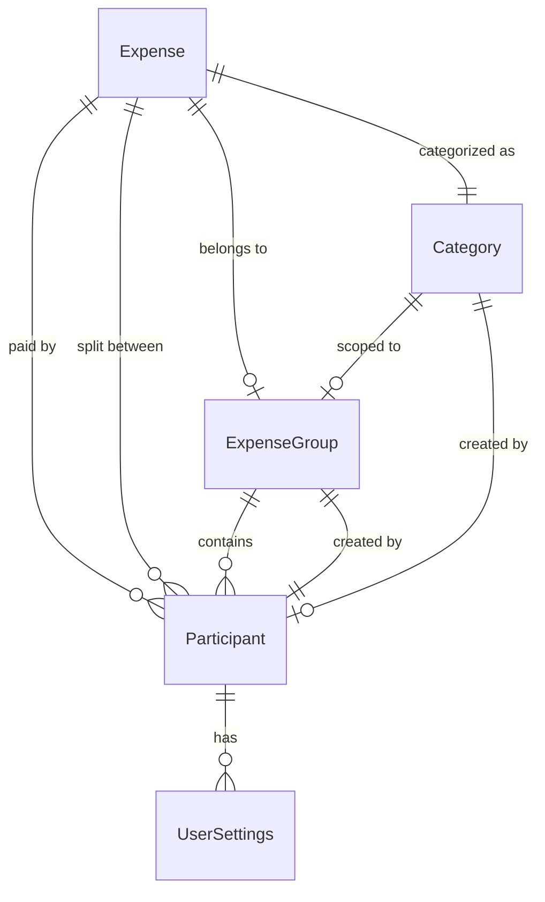
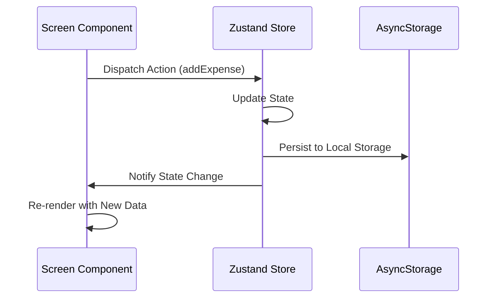
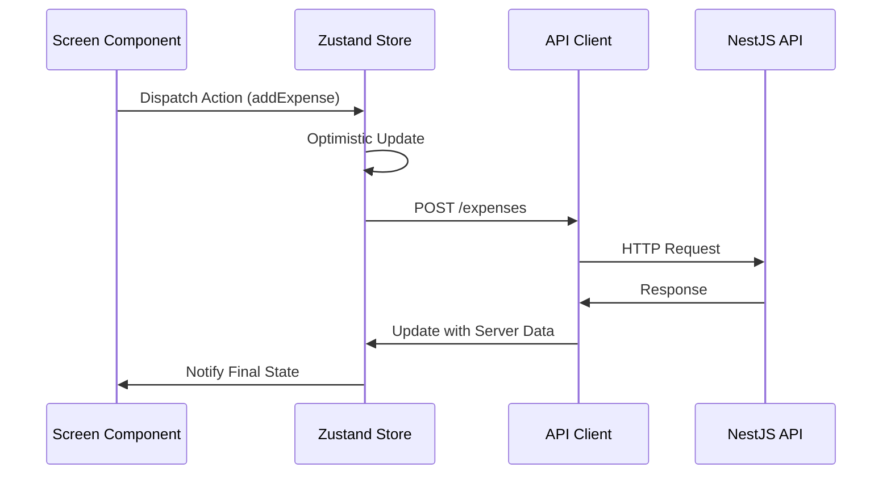

# System Architecture

_Last Updated: August 26, 2025_

## System Overview

This document describes the architecture of the Expense Tracking Application, a monorepo containing three interconnected applications designed for couples and group expense management.

### Current Architecture (Phase 1)

```mermaid
graph TB
    User[👤 User] --> Mobile[📱 Mobile App]
    Mobile --> Store[🗄️ Zustand Store]
    Store --> AsyncStorage[💾 Local Storage]

    API[🔧 NestJS API] -.-> Database[(🗄️ PostgreSQL)]
    Web[🌐 Next.js Web] -.-> API

    subgraph "Current State"
        Mobile
        Store
        AsyncStorage
    end

    subgraph "Future State (Phase 2-3)"
        API
        Database
        Web
    end

    classDef current fill:#e1f5fe
    classDef future fill:#fff3e0
    class Mobile,Store,AsyncStorage current
    class API,Database,Web future
```



### Target Architecture (Phase 3+)

```mermaid
graph TB
    MobileUser[👤 Mobile User] --> MobileApp[📱 Mobile App]
    WebUser[👤 Web User] --> WebApp[🌐 Web Dashboard]

    MobileApp --> Auth[🔐 Auth Service]
    WebApp --> Auth

    MobileApp --> APIGateway[🚪 API Gateway]
    WebApp --> APIGateway

    APIGateway --> ExpenseAPI[💰 Expense Service]
    APIGateway --> UserAPI[👥 User Service]
    APIGateway --> GroupAPI[👨‍👩‍👧‍👦 Group Service]

    ExpenseAPI --> Database[(🗄️ PostgreSQL)]
    UserAPI --> Database
    GroupAPI --> Database

    ExpenseAPI --> Cache[(⚡ Redis Cache)]

    Database --> Backup[(📦 Backups)]

    subgraph "Authentication Layer"
        Auth
    end

    subgraph "API Layer"
        APIGateway
        ExpenseAPI
        UserAPI
        GroupAPI
    end

    subgraph "Data Layer"
        Database
        Cache
        Backup
    end
```



## Domain Models & Shared Concepts

### Core Business Entities

#### Expense Entity

The central entity representing a financial transaction.

```typescript
interface Expense {
  id: string; // Unique identifier (UUID in production)
  title: string; // Human-readable description
  amount: number; // Amount in smallest currency unit (cents)
  currency: string; // ISO currency code (future: 'USD', 'EUR', etc.)
  date: string; // ISO date string
  caption?: string; // Optional additional description
  category: ExpenseCategory; // Category classification

  // Group & Participant Management
  groupId?: string; // Optional group association
  paidBy?: string; // Participant ID who made the payment
  splitBetween?: string[]; // Array of participant IDs for cost splitting
  participants?: Participant[]; // Cached participant data for offline use

  // Metadata
  createdAt: string; // Creation timestamp
  updatedAt: string; // Last modification timestamp
  syncStatus?: 'local' | 'synced' | 'pending'; // Sync status with server
}
```

#### ExpenseGroup Entity

Groups for organizing shared expenses between multiple participants.

```typescript
interface ExpenseGroup {
  id: string; // Unique identifier
  name: string; // Group display name
  description?: string; // Optional group description
  participants: Participant[]; // Members of this group

  // Metadata
  createdAt: string; // Creation timestamp
  createdBy: string; // Creator participant ID

  // Group Settings
  defaultCurrency: string; // Default currency for group expenses
  splitStrategy: 'equal' | 'custom'; // Default split strategy

  // Invitation & Access
  inviteCode?: string; // Shareable invite code
  isArchived: boolean; // Soft deletion flag
}
```

#### Participant Entity

Represents users who can participate in expenses and groups.

```typescript
interface Participant {
  id: string; // Unique identifier
  name: string; // Display name
  email?: string; // Email address (for invitations)
  avatar?: string; // Profile image URL

  // User Status
  isRegistered: boolean; // Whether user has registered account
  lastActiveAt?: string; // Last activity timestamp

  // Preferences
  defaultCurrency: string; // Preferred currency
  notifications: {
    expenses: boolean; // Expense notifications
    invites: boolean; // Group invite notifications
    reminders: boolean; // Payment reminder notifications
  };
}
```

#### Category Entity

Customizable expense categories with visual styling.

```typescript
interface Category {
  id: string; // Unique identifier (name-based or UUID)
  name: string; // Category display name
  color: string; // Hex color code for UI
  icon?: string; // Optional icon identifier

  // Category Management
  isDefault: boolean; // System default vs. user-created
  createdBy?: string; // Creator participant ID (for custom categories)
  groupId?: string; // Group-specific categories

  // Usage Tracking
  usageCount?: number; // Number of expenses using this category
  lastUsedAt?: string; // Last usage timestamp
}
```

### Data Relationships



### Business Rules & Constraints

#### Expense Rules

- Amount must be positive (> 0)
- At least one participant must be specified for group expenses
- PaidBy participant must be in splitBetween array
- Sum of split percentages must equal 100% (for custom splits)
- Category must exist and be accessible to the user

#### Group Rules

- Groups must have at least one participant
- Group creator cannot be removed from group
- Invite codes expire after 7 days
- Maximum 50 participants per group

#### Participant Rules

- Names must be unique within a group
- Email addresses must be unique globally (when registered)
- Unregistered participants can only access via invite codes

## Mobile App Architecture (React Native + Expo)

### State Management Architecture

#### Zustand Store Pattern

The mobile app uses Zustand for centralized state management with a single store approach.

```typescript
// Current Store Structure (361 lines - needs refactoring per PLANNING.md)
interface ExpenseState {
  // Data Entities
  expenses: Expense[];
  groups: ExpenseGroup[];
  participants: Participant[];
  categories: Category[];

  // User State
  userSettings: UserSettings | null;
  internalUserId: string | null; // Temporary user ID for local-only mode

  // Actions (CRUD Operations)
  addExpense: (expense: Omit<Expense, 'id'>) => void;
  updateExpense: (expense: Expense) => void;
  deleteExpense: (id: string) => void;
  // ... (full interface in src/types/index.ts)
}
```

#### Planned Store Refactoring

To comply with 500-line file limit, the store will be decomposed:

```typescript
// Future Store Composition
interface AppState
  extends ExpenseStore, // Core expense operations
    GroupStore, // Group management
    ParticipantStore, // Participant operations
    CategoryStore, // Category management
    UserStore, // User settings
    UIStore {
  // UI state, modals, loading
}
```

### Navigation Architecture

#### Stack + Tab Navigation Pattern

```typescript
// Navigation Structure
RootStackParamList = {
  Main: undefined;                    // Tab Navigator Container
  AddExpense: { expense?: Expense };  // Modal for expense creation/editing
  GroupDetail: { groupId: string };   // Group detail view
  ExpenseInsights: {                  // Analytics screen
    contextType: 'personal' | 'group';
    contextId: string;
  };
  ManageCategoriesScreen: undefined;  // Category management
}

// Tab Structure
TabParamList = {
  History: undefined;    // Groups and expense history
  Home: undefined;       // Personal expenses
  Settings: undefined;   // User settings and preferences
}
```

### Component Architecture

#### Current Structure (Pre-Refactoring)

```
src/
├── components/          # Reusable UI components
├── screens/             # Screen-level components (many exceed 500 lines)
├── hooks/               # Custom React hooks
├── utils/               # Pure utility functions
├── types/               # TypeScript type definitions
├── constants/           # Application constants
└── store/               # State management
```

#### Target Atomic Design Structure

```
src/
├── components/
│   ├── ui/              # Atomic components (Button, Input, etc.)
│   ├── forms/           # Form-related molecules
│   ├── lists/           # List item components
│   ├── modals/          # Modal organisms
│   └── insights/        # Analytics components
├── screens/             # Screen containers (<200 lines each)
├── hooks/
│   ├── forms/           # Form management hooks
│   ├── data/            # Data fetching hooks
│   └── ui/              # UI state hooks
├── utils/
│   ├── calculations/    # Business logic calculations
│   ├── formatters/      # Data formatting utilities
│   └── validation/      # Input validation utilities
└── store/               # Decomposed state stores
```

### Data Flow Patterns

#### Current: Local-Only Data Flow



#### Future: Server-Sync Data Flow



### Performance Considerations

#### Bundle Size Management

- Code splitting by screen using dynamic imports
- Image optimization with Expo's asset pipeline
- Font subsetting for international support

#### Rendering Optimization

- React.memo for expensive components
- FlatList for large data sets (expense lists)
- Lazy loading for analytics charts

## API Architecture (NestJS)

### Current State

The API is currently a minimal NestJS scaffold with only a "Hello World" endpoint. Development will follow the phases outlined in the ROADMAP.md.

### Planned Architecture

#### Module Structure

```
src/
├── auth/                # Authentication & authorization
│   ├── auth.controller.ts
│   ├── auth.service.ts
│   └── strategies/      # Passport strategies
├── users/               # User management
├── expenses/            # Expense CRUD operations
├── groups/              # Group management
├── participants/        # Participant operations
├── categories/          # Category management
├── common/              # Shared utilities
│   ├── decorators/
│   ├── filters/
│   └── pipes/
└── database/            # Database configuration
    ├── entities/
    └── migrations/
```

#### Service Layer Pattern

```typescript
@Injectable()
export class ExpenseService {
  constructor(
    @InjectRepository(Expense)
    private expenseRepository: Repository<Expense>,
    private groupService: GroupService,
  ) {}

  async createExpense(
    createExpenseDto: CreateExpenseDto,
    userId: string,
  ): Promise<Expense> {
    // Validate user permissions
    // Create expense entity
    // Update group balances
    // Send notifications
    return expense;
  }
}
```

#### Database Schema (TypeORM)

```typescript
@Entity()
export class Expense {
  @PrimaryGeneratedColumn('uuid')
  id: string;

  @Column({ type: 'decimal', precision: 10, scale: 2 })
  amount: number;

  @Column()
  currency: string;

  @ManyToOne(() => User, { eager: true })
  paidBy: User;

  @ManyToMany(() => User, { eager: true })
  @JoinTable()
  splitBetween: User[];

  @ManyToOne(() => ExpenseGroup, { nullable: true })
  group: ExpenseGroup;

  @CreateDateColumn()
  createdAt: Date;

  @UpdateDateColumn()
  updatedAt: Date;
}
```

### API Design Patterns

#### RESTful Endpoints

```
GET    /api/expenses              # List user's expenses
POST   /api/expenses              # Create new expense
GET    /api/expenses/:id          # Get specific expense
PUT    /api/expenses/:id          # Update expense
DELETE /api/expenses/:id          # Delete expense

GET    /api/groups               # List user's groups
POST   /api/groups               # Create new group
POST   /api/groups/:id/join      # Join group via invite code
GET    /api/groups/:id/expenses  # Get group expenses
```

#### Authentication & Authorization

- JWT-based authentication with refresh tokens
- Role-based access control (Owner, Member, Guest)
- Rate limiting for API endpoints
- Request validation using class-validator

## Web Application Architecture (Next.js)

### Current State

Basic Next.js 15 setup with App Router. No custom functionality implemented yet.

### Planned Architecture

#### App Router Structure

```
src/app/
├── (auth)/              # Authentication routes
│   ├── login/
│   └── register/
├── dashboard/           # Main dashboard
│   ├── expenses/
│   ├── groups/
│   └── insights/
├── api/                 # API routes (proxy to NestJS)
├── globals.css
└── layout.tsx
```

#### State Management Strategy

- Server Components for data fetching
- React Query for client-side caching
- Zustand for complex client state
- Form state with React Hook Form

#### Component Architecture

```
src/components/
├── ui/                  # Shadcn/ui components
├── forms/               # Form components
├── charts/              # Data visualization
├── tables/              # Data tables with sorting/filtering
└── layouts/             # Page layouts
```

### Server vs. Client Components

#### Server Components (Data Fetching)

```typescript
// app/dashboard/expenses/page.tsx
export default async function ExpensesPage() {
  const expenses = await getExpenses(); // Direct API call
  return <ExpenseList expenses={expenses} />;
}
```

#### Client Components (Interactivity)

```typescript
'use client';
// components/forms/ExpenseForm.tsx
export default function ExpenseForm() {
  const [expense, setExpense] = useState<Expense>();
  // Interactive form logic
}
```

## Deployment & Infrastructure

### Development Environment

```
Local Development:
- Mobile: Expo Development Build + Expo Go
- API: Docker Compose (PostgreSQL + Redis)
- Web: Next.js dev server

Testing:
- Mobile: Expo SDK simulator
- API: Jest + Supertest
- Web: Playwright E2E tests
```

### Production Architecture (Phase 6)

```
Infrastructure:
- Mobile: Expo Application Services (EAS)
- API: AWS ECS/Fargate with Application Load Balancer
- Web: Vercel deployment with CDN
- Database: AWS RDS PostgreSQL with read replicas
- Cache: AWS ElastiCache Redis
- File Storage: AWS S3 for user avatars/receipts
- Monitoring: DataDog/Sentry for error tracking
```

### CI/CD Pipeline

```yaml
# .github/workflows/ci.yml
jobs:
  api:
    - pnpm --filter api lint
    - pnpm --filter api build
    - pnpm --filter api test (Postgres service)
  web:
    - pnpm --filter web lint
    - pnpm --filter web build
  mobile:
    - pnpm --filter mobile typecheck
    - pnpm --filter mobile test:unit:fast
```

## Migration Path: Local-Only to Multi-User

### Phase 1: Local Data Export/Import

```typescript
// Data migration utilities
interface MigrationData {
  expenses: Expense[];
  groups: ExpenseGroup[];
  participants: Participant[];
  categories: Category[];
  exportedAt: string;
  version: string;
}

// Export existing local data
export const exportLocalData = (): MigrationData => {
  const store = useExpenseStore.getState();
  return {
    expenses: store.expenses,
    groups: store.groups,
    participants: store.participants,
    categories: store.categories,
    exportedAt: new Date().toISOString(),
    version: '1.0.0',
  };
};
```

### Phase 2: Hybrid Mode (Local + Server Sync)

```typescript
// Sync strategy for offline-first functionality
interface SyncQueue {
  pendingOperations: {
    type: 'CREATE' | 'UPDATE' | 'DELETE';
    entity: 'expense' | 'group' | 'participant';
    data: any;
    timestamp: string;
  }[];
}

// Conflict resolution strategy
enum ConflictResolution {
  SERVER_WINS = 'server',
  CLIENT_WINS = 'client',
  MANUAL_RESOLVE = 'manual',
}
```

### Phase 3: Full Server Integration

- Replace local Zustand store with API calls
- Implement real-time updates via WebSocket
- Add proper user authentication
- Enable multi-device synchronization

## Security Considerations

### Data Protection

- End-to-end encryption for sensitive financial data
- PII (Personally Identifiable Information) protection
- GDPR compliance for EU users
- Data retention policies

### API Security

- Rate limiting (100 requests/minute per user)
- Input validation and sanitization
- SQL injection prevention
- CORS configuration
- API versioning for backwards compatibility

### Mobile Security

- Secure storage for authentication tokens
- Certificate pinning for API communications
- Biometric authentication for app access
- App-level encryption for cached data

## Performance & Scalability

### Database Optimization

- Proper indexing strategy for expense queries
- Partitioning for large expense tables
- Read replicas for analytics queries
- Connection pooling and query optimization

### Caching Strategy

- Redis for session data and frequent queries
- CDN for static assets and images
- Application-level caching for calculated balances
- Browser caching for web assets

### Mobile Performance

- Image optimization and lazy loading
- Bundle size monitoring (<10MB initial)
- Memory usage optimization
- Background sync for data updates

---

_This architecture document is a living specification that evolves with the application. All major architectural changes should be documented here and reflected in the codebase._
