# Mobile App Refactoring Plan

This document outlines the plan to refactor the mobile application codebase for improved structure, maintainability, and reusability.

## Goals

- Improve directory structure for better organization.
- Increase component granularity by breaking down large screens.
- Separate concerns (UI, business logic, state management).
- Enhance code reusability through shared components and hooks.
- Centralize type definitions and constants.

## Proposed Directory Structure

```
apps/mobile/src/
├── components/      # Reusable UI components (Buttons, Modals, ListItems, Inputs)
├── constants/       # Application constants (e.g., expense categories)
├── hooks/           # Custom React Hooks (e.g., form handling, modal state)
├── screens/         # Screen components (remain here, but simplified)
├── store/           # Zustand store (remains here)
├── types/           # Shared TypeScript interfaces and types
└── utils/           # Utility functions (e.g., calculations, formatting)
```

## Refactoring Steps

1.  **Create New Directories:** Establish the structure outlined above.
2.  **Centralize Types & Constants:**
    - Move interfaces from `store/expenseStore.ts` to `types/`.
    - Move `EXPENSE_CATEGORIES` to `constants/expenses.ts`.
3.  **Refactor `AddExpenseScreen.tsx`:**
    - Extract form logic into `hooks/useExpenseForm.ts`.
    - Create reusable components in `components/`: `FormInput`, `SelectInput`, `ParticipantTag`, `SelectionModal`, `DatePicker`.
    - Simplify the screen component to use the hook and reusable components.
4.  **Refactor `HistoryScreen.tsx`:**
    - Extract `components/GroupListItem.tsx`.
    - Extract calculations into `utils/groupCalculations.ts` or `hooks/useGroupDetails`.
    - Replace modals with reusable components (e.g., `components/TextInputModal.tsx`).
5.  **Refactor `HomeScreen.tsx`:**
    - Extract `components/ExpenseListItem.tsx`.
    - Extract total calculation into `utils/expenseCalculations.ts`.

## Structure Visualization (Mermaid)

```mermaid
graph TD
    A[apps/mobile/src] --> B(components);
    A --> C(constants);
    A --> D(hooks);
    A --> E(screens);
    A --> F(store);
    A --> G(types);
    A --> H(utils);

    B --> B1(FormInput.tsx);
    B --> B2(SelectInput.tsx);
    B --> B3(ParticipantTag.tsx);
    B --> B4(SelectionModal.tsx);
    B --> B5(DatePicker.tsx);
    B --> B6(GroupListItem.tsx);
    B --> B7(ExpenseListItem.tsx);
    B --> B8(TextInputModal.tsx);

    C --> C1(expenses.ts);

    D --> D1(useExpenseForm.ts);
    D --> D2(useModalState.ts);
    D --> D3(useGroupDetails.ts);

    E --> E1(AddExpenseScreen.tsx);
    E --> E2(HistoryScreen.tsx);
    E --> E3(HomeScreen.tsx);
    E --> E4(SettingsScreen.tsx);

    F --> F1(expenseStore.ts);

    G --> G1(index.ts);

    H --> H1(groupCalculations.ts);
    H --> H2(expenseCalculations.ts);
    H --> H3(dateUtils.ts);

    E1 -- uses --> D1;
    E1 -- uses --> B1;
    E1 -- uses --> B2;
    E1 -- uses --> B3;
    E1 -- uses --> B4;
    E1 -- uses --> B5;

    E2 -- uses --> B6;
    E2 -- uses --> D3;
    E2 -- uses --> B8;
    E2 -- uses --> H1;

    E3 -- uses --> B7;
    E3 -- uses --> H2;

    F1 -- uses --> G1;
    F1 -- uses --> C1;
    E -- uses --> G1;
    D -- uses --> G1;
    B -- uses --> G1;
```


