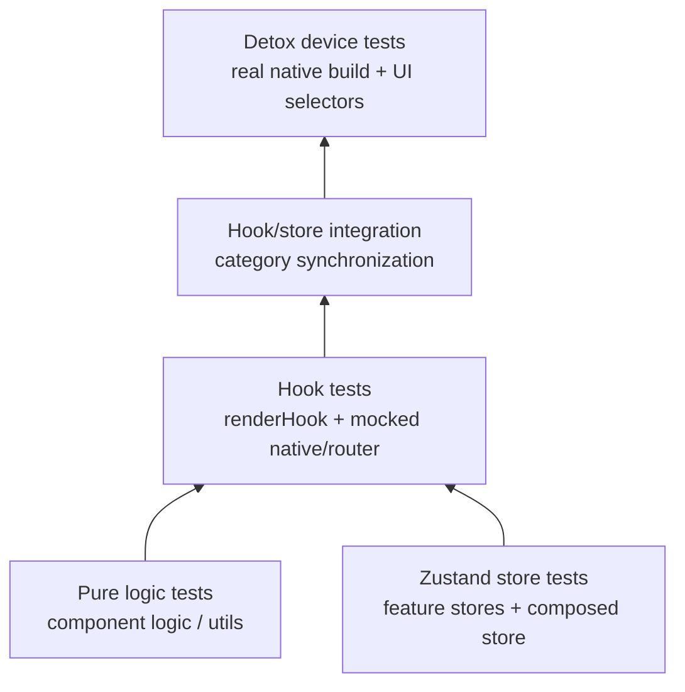
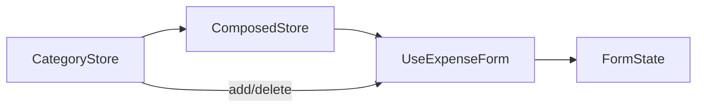

# Expense App Mobile 測試導讀與現有測試目錄

> 本文件以 `apps/mobile/` 的目前測試、Jest 與 Detox 設定為準。最後核對日期：2026-07-13。

## 1. 這份文件回答什麼？

這份導讀說明：

- Mobile app 目前有哪些 unit、integration、performance 與 E2E tests。
- Jest 的 unit/integration projects 如何分流與 mock native modules。
- 每個測試檔負責保護哪些行為。
- package scripts 實際會收集哪些測試。
- Detox 原始碼、test runner 設定與 `testID` 的現況。
- 如何執行測試，以及目前較明顯的 coverage 空白。

## 2. 目前測試數量與執行結果

### 2.1 Jest：目前可執行的 Mobile tests

| Project     | 測試檔 | 靜態 `it/test` cases | 2026-07-13 實際結果               |
| ----------- | -----: | -------------------: | --------------------------------- |
| Unit        |     25 |                  263 | 通過                              |
| Integration |      1 |                    7 | 通過                              |
| 合計        |     26 |                  270 | **26 suites、270 tests 全部通過** |

本次使用本機已安裝的 Jest 實際執行：

```text
Test Suites: 26 passed, 26 total
Tests:       270 passed, 270 total
Snapshots:   0 total
```

### 2.2 Detox E2E：存在與實際收集範圍不同

| 範圍                          | 測試檔 | 靜態 cases | 本次是否執行 |
| ----------------------------- | -----: | ---------: | ------------ |
| Repo 中全部 E2E source        |      3 |         45 | 否           |
| `e2e/jest.config.js` 實際匹配 |      1 |         17 | 否           |
| 未被目前設定匹配              |      2 |         28 | 否           |

本次用 Jest `--listTests` 確認 Detox 設定只收集：

```text
e2e/expenseFlow.test.js
```

原因是 `testMatch` 只接受 `e2e/**/*.test.js`，所以：

- `expenseFlow.test.js`：會收集。
- `dataValidation.e2e.js`：不會收集。
- `userOnboarding.e2e.js`：不會收集。

Detox 需要原生 app build 與 simulator/emulator，本次沒有執行 E2E，因此不能宣稱 17 個已收集 cases 通過。

### 2.3 舊文件數字為何不同？

舊摘要曾記錄 23 unit files／268 tests、2 integration files／23 tests，以及 62 E2E tests。現在原始碼與命名已改變，應以本文件、Jest collection 與最新執行結果為準。

目前也沒有找到 `skip`、`todo`、`xit` 或 `xdescribe`。

## 3. Mobile 測試架構



目前測試重心在純邏輯與 Zustand state：

| Unit 類別          | 檔案數 | Cases |
| ------------------ | -----: | ----: |
| Component logic    |     10 |   132 |
| Hooks              |      4 |    12 |
| Stores             |      6 |    50 |
| Utils/calculations |      4 |    66 |
| Store performance  |      1 |     3 |
| Unit 合計          |     25 |   263 |

另外有 1 個 hook/store integration file，共 7 cases。

## 4. Jest projects 與 setup

### 4.1 `jest.config.js`

同一個 Jest config 定義兩個 projects：

```javascript
projects: [
  {
    displayName: 'unit',
    testMatch: ['<rootDir>/**/__tests__/**/*.unit.(ts|tsx)'],
    setupFilesAfterEnv: ['<rootDir>/jest.setup.unit.ts'],
  },
  {
    displayName: 'integration',
    testMatch: ['<rootDir>/**/__tests__/**/*.int.(ts|tsx)'],
    setupFilesAfterEnv: ['<rootDir>/jest.setup.int.ts'],
  },
];
```

兩個 projects 都使用：

- `jest-expo` preset。
- `babel-jest` 轉換 TypeScript/JSX。
- `jsdom` test environment。
- React Native／Expo package 的 transform allowlist。
- `@/` → `src/` module alias。

### 4.2 Unit setup

`jest.setup.unit.ts`：

1. 載入 `src/__tests__/setup-component.ts`。
2. 加入 `TextEncoder/TextDecoder` polyfill。
3. 以 `__mocks__/expo-router.ts` mock Expo Router。

`setup-component.ts` 另外 mock：

- Reanimated。
- Gesture Handler。
- Safe Area Context。
- Expo Status Bar。
- React Native SVG。
- Gifted Charts。
- AsyncStorage。
- DateTimePicker、Picker、LinearGradient。
- `console.warn/error`。

因此 unit tests 不需要載入真正的 native module，也不會真的導航或寫入裝置 storage。

### 4.3 Integration setup

`jest.setup.int.ts` 的設計目標是少 mock 且不全域 mock Expo Router。它仍 mock Reanimated、Gesture Handler、Safe Area、Status Bar 等 native UI dependencies。

不過目前唯一的 integration spec `useExpenseForm-category-sync.int.tsx` 自己又 mock 了：

```typescript
jest.mock('expo-router', () => ({
  router: { back: jest.fn() },
}));
```

所以這個 integration project 目前驗證的是 hook 與 stores 的整合，不是真實 Expo Router navigation。

## 5. Coverage 設定

Unit project 設定的 global threshold：

| Metric     | Threshold |
| ---------- | --------: |
| Branches   |       80% |
| Functions  |       90% |
| Lines      |       90% |
| Statements |       90% |

`collectCoverageFrom` 只包含：

- `src/store/`
- `src/hooks/`
- `src/utils/`
- `src/constants/`

明確排除 components、screens 與 app routes。因此 coverage 達標表示核心 state/logic 達標，不代表整個 Mobile UI 有 90% coverage。

## 6. Component logic tests

目錄：`apps/mobile/src/components/__tests__/`

| 檔案                                 | Cases | 主要覆蓋                                                                         |
| ------------------------------------ | ----: | -------------------------------------------------------------------------------- |
| `CategoryChart-simple.unit.ts`       |     6 | chart data、empty state、percentage、legend、hex color、fallback color           |
| `CategoryForm-logic.unit.ts`         |     8 | name/color/form validation、ID、duplicate、palette、state reset                  |
| `ExpenseListItem-logic.unit.ts`      |    17 | payer lookup、amount display、tags、actions、props、長文字與空資料               |
| `FloatingActionButton-logic.unit.ts` |    15 | navigation params、custom handler、style、accessibility、rapid taps、error cases |
| `FormInput-logic.unit.ts`            |    10 | props、keyboard type、multiline、text/length validation                          |
| `FormInput-advanced.unit.ts`         |     8 | transformation、debounce/history、accessibility、Unicode、rapid input            |
| `GroupListItem-logic.unit.ts`        |    16 | totals、participants、actions、group validation、edge cases                      |
| `HistoryScreen-logic.unit.ts`        |    15 | group ordering、balance、navigation、search、statistics/trends                   |
| `HomeScreen-logic.unit.ts`           |    20 | expense grouping、totals、FAB、empty/loading state、refresh/sync display         |
| `SelectInput-logic.unit.ts`          |    17 | value/placeholder、props、interaction、style、accessibility、edge cases          |

### 6.1 這些是「邏輯測試」，不是 rendered component tests

目前這 10 個檔案大多在 spec 內建立小型 helper/logic，再驗證輸出；它們沒有 import 並 render 對應的 production component。

因此它們能保護：

- 計算與格式化規則。
- props/data validation 概念。
- navigation parameter 組裝。
- accessibility props 產生邏輯。

但不能證明：

- 真正 JSX 是否把 props 接到正確 native element。
- 使用者按下畫面後 event handler 是否真的觸發。
- 畫面上的文字、樣式、modal 與 accessibility tree 是否正確。
- production component refactor 後 spec 內複製的邏輯是否同步更新。

要驗證後者，應使用 React Native Testing Library `render()` 實際 production component。

## 7. Hook tests

目錄：`apps/mobile/src/hooks/__tests__/`

| 檔案                          | Cases | 主要覆蓋                                                       |
| ----------------------------- | ----: | -------------------------------------------------------------- |
| `useCategoryManager.unit.tsx` |     4 | create/edit modal、add、duplicate、update、保護 Other category |
| `useExpenseForm.unit.tsx`     |     3 | personal expense、group validation、edit expense、router back  |
| `useExpenseModals.unit.tsx`   |     3 | group dependent state、split selection、前往分類管理           |
| `useInsightsData.unit.tsx`    |     2 | personal/group chart data、期間切換、participants              |

這些測試使用 `renderHook()`，並直接重設 Zustand stores，屬於「真實 hook + 真實 store + mocked native/router」測試。

## 8. Zustand store tests

目錄：`apps/mobile/src/store/__tests__/`

| 檔案                           | Cases | 主要覆蓋                                                                                       |
| ------------------------------ | ----: | ---------------------------------------------------------------------------------------------- |
| `expenseStore.unit.ts`         |    18 | add/update/delete/get、排序、group expense、orphan migration、移除 group/participant reference |
| `categoryStore.unit.ts`        |     5 | add、duplicate、update existing color、保護 Other、lookup                                      |
| `participantStore.unit.ts`     |     6 | add/override、duplicate、同步登入者、delete、lookup                                            |
| `groupStore.unit.ts`           |     6 | CRUD、creator participant、membership add/remove/update                                        |
| `userStore.unit.ts`            |     6 | profile、create user、settings merge、legacy sync、internal ID fallback                        |
| `composedExpenseStore.unit.ts` |     9 | 跨 feature stores 同步 user/participant/group/category/expense/settings                        |

### 8.1 為什麼 composed store 測試重要？

`composedExpenseStore` 會訂閱五個 feature stores，並在刪 Group／Participant 時同步修改 Expense 等下游資料。單獨 feature store 通過，不能保證跨 store side effects 正確；這 9 cases 就是在保護這層協調邏輯。

## 9. Utils 與財務計算 tests

目錄：`apps/mobile/src/utils/__tests__/`

| 檔案                          | Cases | 主要覆蓋                                                                        |
| ----------------------------- | ----: | ------------------------------------------------------------------------------- |
| `expenseCalculations.unit.ts` |     8 | expense total、user share、anonymous/payer/split participant cases              |
| `groupCalculations.unit.ts`   |     4 | group total、user contribution、member balances、empty members                  |
| `insightCalculations.unit.ts` |    37 | category totals/chart、日期過濾、personal/group context、period navigation/text |
| `simple.unit.ts`              |    17 | insight calculations 的簡化／日期 mock regression cases                         |

`insightCalculations.unit.ts` 是目前最大的 utils suite，特別保護月份／年份邊界與「不能切到未來期間」的規則。

`simple.unit.ts` 和完整 insight suite 有部分重疊；修改日期邏輯時要確認兩份測試是否仍在保護不同層次的行為。

## 10. Store performance tests

檔案：`src/__tests__/performance/store-performance.unit.ts`

| Case                                   | 一般執行 threshold | Coverage 執行 threshold |
| -------------------------------------- | -----------------: | ----------------------: |
| 寫入 1,000 筆 Expense                  |              800ms |                 1,500ms |
| 對 750 筆 Expense 重複 aggregate 25 次 |              300ms |                   700ms |
| 處理 1,500 筆 Expense 的 heap growth   |          低於 12MB |               低於 12MB |

Mobile test script 用 `node --expose-gc` 啟動 Jest，因此 memory case 可在 available 時呼叫 `global.gc()`，降低量測雜訊。

這些是 Node/JSDOM 中的 store regression budget，不等同真實低階手機上的 UI frame、startup time 或 native memory benchmark。

## 11. Integration test

目前只有：

| 檔案                                   | Cases | 主要覆蓋                                                                                                   |
| -------------------------------------- | ----: | ---------------------------------------------------------------------------------------------------------- |
| `useExpenseForm-category-sync.int.tsx` |     7 | Category store 與 form categories 同步、add/delete、default/fallback、edit/reset、保留 historical category |

資料流如下：



它能證明 category source of truth 改變時 hook 會更新，但目前沒有 render 真實 Add Expense screen，也沒有測真實 router transition。

## 12. Detox E2E tests

### 12.1 `expenseFlow.test.js`：17 cases，目前會被收集

| 群組                   | Cases | 情境                                                |
| ---------------------- | ----: | --------------------------------------------------- |
| New User Onboarding    |     2 | 第一筆 Expense、建立 Group 前 username requirement  |
| Expense Management     |     3 | create/edit/delete、validation、caption             |
| Group Management       |     3 | group expense、insights/totals、participant balance |
| Category Management    |     3 | category CRUD、保護 Other、用新 category 建 Expense |
| Insights and Analytics |     3 | analytics、empty state、period filter               |
| Data Persistence       |     1 | app restart 後保留 Expense/user                     |
| Error Handling         |     2 | invalid amount、empty group name                    |

### 12.2 `dataValidation.e2e.js`：17 cases，目前不會被收集

涵蓋：

- 跨畫面 category/group/expense state consistency。
- restart persistence 與 rapid concurrent updates。
- amount precision、date/timezone、Unicode、category boundary。
- totals、splits、large numbers。
- partial corruption、missing category、rapid CRUD。
- empty states 與 date boundary。

### 12.3 `userOnboarding.e2e.js`：11 cases，目前不會被收集

涵蓋：

- first-time Expense 與 username gating。
- Group、Insights、Category progressive discovery。
- currency/theme/display name settings。
- local-storage-style recovery、form/username validation。

### 12.4 E2E helpers 有兩套

- `e2e/setup.js` 建立 global `testHelpers`，目前被收集的 `expenseFlow.test.js` 使用它。
- `e2e/helpers/testHelpers.js` export 另一套 helper，兩個未被收集的 `*.e2e.js` 使用它。

兩套 helper 的文字 selector 和流程不完全相同，修改 UI 時可能只更新其中一份。長期應考慮合併成單一 source of truth。

## 13. Detox native build 與 selector 現況

`.detoxrc.js` 定義 iOS simulator、Android attached device 與 emulator configurations，但目前 repository 中沒有 `apps/mobile/ios/` 或 `apps/mobile/android/` 目錄。

所以執行 Detox build 前需要先有相符的 native project／prebuild 產物，而且應明確選擇 configuration，例如：

```bash
pnpm --filter mobile test:e2e:build --configuration ios.sim.debug
pnpm --filter mobile test:e2e --configuration ios.sim.debug
```

`.detoxrc.js` 沒有設定 `defaultConfiguration`，直接執行 `detox test` 時應確認 CLI/env 已指定目標。

### 13.1 `testID` coverage

E2E source 使用 22 個不同的 `by.id()` literals。Production source 目前能直接找到的固定 IDs 主要是：

- `add-expense-fab`
- `expense-title-input`
- `expense-amount-input`
- `category-picker`
- `expense-caption-input`
- `date-picker`
- `dateTimePicker`

`DatePicker` 與 `SelectInput` 也接受動態 `testID` prop，但要由 caller 實際傳入才會出現在畫面。

E2E 還引用 `save-expense-button`、`add-group-button`、`group-name-input`、`username-input`、`pie-chart` 等多個 selector，目前在 production source 找不到對應固定 `testID` literal。`by.id()` 不會因為畫面上有相同文字就自動成功，因此這些 selector 需要在真正跑 Detox 前逐一核對。

## 14. Package scripts 的實際行為

### 14.1 建議使用的 Jest 指令

```bash
# Unit + integration；本次 270/270 通過
pnpm --filter mobile test --runInBand

# 只跑 unit project
pnpm --filter mobile test:unit --runInBand

# 只跑 integration project
pnpm --filter mobile test:integration

# 單一檔案
pnpm --filter mobile test expenseStore.unit.ts --runInBand

# 依 case 名稱篩選
pnpm --filter mobile test useExpenseForm.unit.tsx -t "group expenses"

# Store performance
pnpm --filter mobile test:performance

# Coverage
pnpm --filter mobile test:coverage

# TypeScript 與 lint
pnpm --filter mobile typecheck
pnpm --filter mobile lint
```

### 14.2 Unit 與 integration scripts

`package.json` 現況：

```json
{
  "test:unit": "... --selectProjects unit",
  "test:integration": "... --selectProjects integration --runInBand"
}
```

兩個 scripts 直接選擇 `jest.config.js` 中的 project，不再自行重複 filename pattern。2026-07-13 實際驗證結果：

- `test:unit`：25 suites、263 tests 通過。
- `test:integration`：1 suite、7 tests 通過。

### 14.3 `test:all.sh`

綜合 script 依序執行：

1. TypeScript typecheck。
2. ESLint。
3. Jest + coverage。
4. 再執行 coverage threshold check。
5. 只有 `--e2e` 或 `CI=true` 才嘗試 Detox。

它把第 3 步標成 Unit Tests，但命令其實會跑 unit + integration 兩個 Jest projects。

## 15. 如何新增 Mobile test

| 想驗證的內容                       | 建議位置與方式                                                       |
| ---------------------------------- | -------------------------------------------------------------------- |
| 純 calculation/formatting          | `src/utils/__tests__/*.unit.ts`                                      |
| 單一 feature store action          | `src/store/__tests__/*.unit.ts`                                      |
| 跨 stores side effect              | `composedExpenseStore.unit.ts` 或新的 integration spec               |
| Hook state 與 action               | `src/hooks/__tests__/*.unit.tsx` + `renderHook()`                    |
| 真實 component render/event        | `src/components/__tests__/*.unit.tsx` + React Native Testing Library |
| 真實 app route/screen flow（Jest） | `*.int.tsx`，render Expo Router route tree                           |
| 真實 device user journey           | `e2e/*.test.js` + Detox                                              |
| Store 大量資料 regression          | `src/__tests__/performance/*.unit.ts`                                |

一個新 UI feature 通常至少需要：

1. Utils/store 的 pure unit test。
2. Hook 或 component render test。
3. 跨 store／screen integration test。
4. 若是重要使用者旅程，再補 Detox E2E。
5. 新增 E2E selector 時，同時在 production JSX 加穩定且唯一的 `testID`。

## 16. 目前較明顯的 coverage 空白與漂移

依目前程式碼與測試設定盤點：

- 沒有直接 render production component 的 React Native Testing Library tests；Component suites 主要是 spec 內的純邏輯。
- 沒有直接 render `app/` 中 Expo Router screens 的 Jest integration test。
- 唯一 integration spec 仍自行 mock router，沒有驗證真實 route transition 或 params。
- Coverage 設定排除 components、screens 與 app routes。
- 兩個 E2E source files 因副檔名不符合 `testMatch` 而未被收集。
- E2E 引用的多個 `testID` 尚未在 production JSX 找到。
- Detox config 指向尚不存在於 repo 的 iOS/Android native build 目錄。
- E2E 有兩套 helper implementations，selector 與流程可能漂移。
- E2E persistence cases 預期 restart 後資料仍存在，但目前 Zustand stores 沒有使用 `persist()` 或 AsyncStorage；這些情境需要和產品 storage 策略重新對齊。
- 沒有 snapshot tests；畫面結構變更主要不會被 Jest 自動偵測。
- Store performance 是 Node/JSDOM benchmark，沒有真機 frame/render performance test。

這些項目不表示現有 270 個 Jest tests 沒有價值；它們代表下一階段最值得補強的是「真實 production UI、navigation 與可執行的 device E2E」。

## 17. 建議閱讀順序

若要快速理解 Mobile 測試：

1. `jest.config.js`：先看 unit/integration 如何分流。
2. `jest.setup.unit.ts` 與 `setup-component.ts`：了解哪些 native 行為被 mock。
3. `store/__tests__/expenseStore.unit.ts`：看核心 CRUD 與 migration。
4. `store/__tests__/composedExpenseStore.unit.ts`：看跨 store 同步。
5. `hooks/__tests__/useExpenseForm.unit.tsx`：看 form 到 store 的流程。
6. `hooks/__tests__/useExpenseForm-category-sync.int.tsx`：看唯一 integration spec。
7. `e2e/jest.config.js` 與 `.detoxrc.js`：最後確認真機測試收集與 build 邊界。

## 18. 延伸閱讀

- Mobile source：`apps/mobile/src/`
- Expo Router routes：`apps/mobile/app/`
- Jest config：`apps/mobile/jest.config.js`
- Unit setup：`apps/mobile/jest.setup.unit.ts`
- Integration setup：`apps/mobile/jest.setup.int.ts`
- Detox config：`apps/mobile/.detoxrc.js`
- Detox Jest config：`apps/mobile/e2e/jest.config.js`
- Test fixtures：`apps/mobile/src/__tests__/fixtures/index.ts`
- API 測試導讀：`docs/features/testing/GUIDE-API_TESTS.md`
- 舊 Mobile 測試摘要：`docs/features/testing/summary/MOBILE_TEST_OVERVIEW.md`（數量與狀態屬歷史快照）
